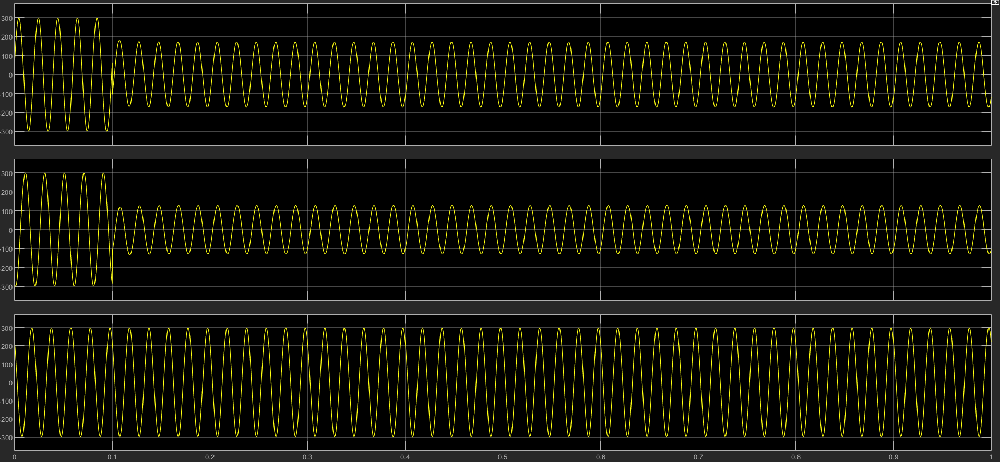
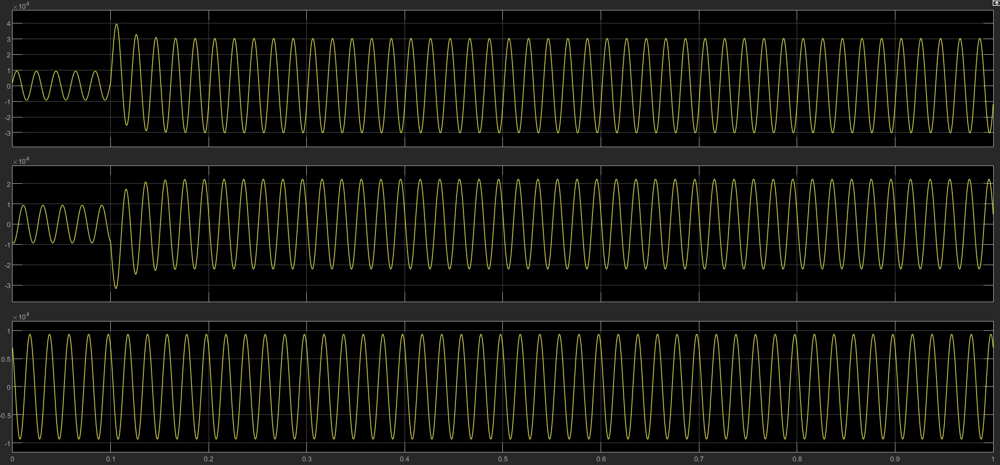
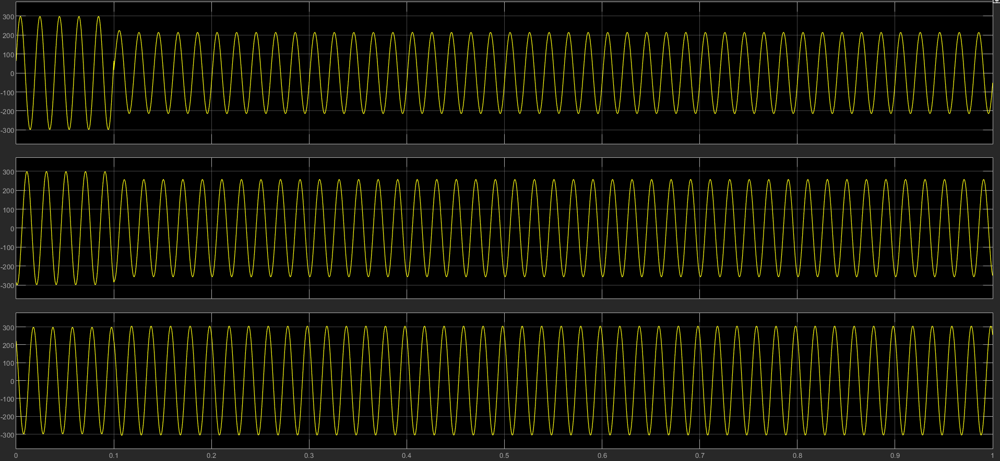
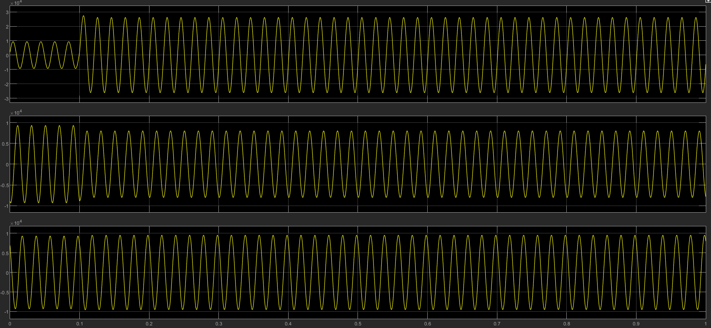
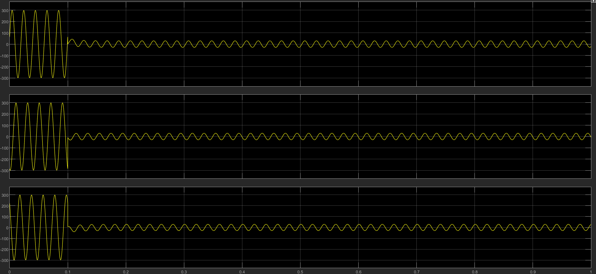
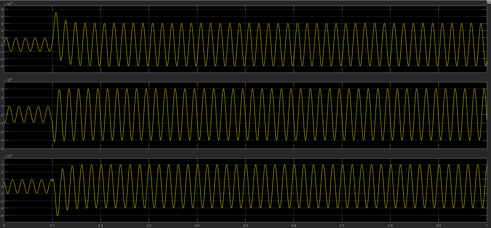
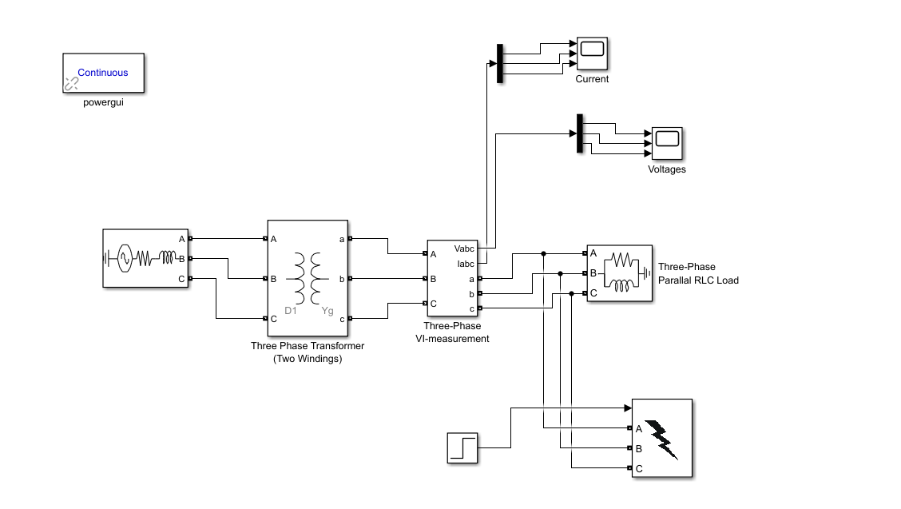

# Three-Phase Fault Analysis Using MATLAB/Simulink

## 📌 Overview

This project presents a MATLAB/Simulink-based simulation and analysis of a three-phase electrical power system under different fault conditions.

The objective of the project is to understand how different faults affect the three-phase voltage and current waveforms and to analyze the transient behavior of the system when a fault is introduced.

The simulation was performed for Line-to-Line (LL), Line-to-Ground (LG), and Three-Phase-to-Ground (LLLG) fault conditions.

---

## 🎯 Objectives

- Develop a three-phase power system model using MATLAB/Simulink.
- Analyze the behavior of the system under different fault conditions.
- Observe changes in three-phase voltage and current waveforms.
- Study the transient response immediately after fault initiation.
- Compare the effects of LL, LG, and LLLG faults.
- Understand the relationship between fault conditions, voltage reduction, and fault current increase.

---

## 🛠️ Software Used

- MATLAB
- Simulink
- Simscape Electrical / Specialized Power Systems

---

## ⚡ System Components

The simulation model consists of the following major blocks:

- Three-Phase Voltage Source
- Three-Phase Transformer
- Parallel RLC Load
- Fault/Breaker Configuration
- Voltage Measurement
- Current Measurement
- Demux
- Scope
- Unit Step Function

---

## ⚙️ System Parameters

| Parameter | Value |
|-----------|-------|
| Supply Frequency | 50 Hz |
| Fault Initiation Time | 0.1 s |
| System | Three-Phase AC |
| Load | Parallel RLC |
| Fault Control | Unit Step |

---

## 🔬 Methodology

The three-phase voltage source supplies the electrical system through a three-phase transformer and connected parallel RLC load.

Voltage and current measurement blocks are used to obtain the corresponding electrical quantities.

The measured three-phase signals are separated using a Demux block and displayed using Scope.

Initially, the system operates under normal conditions. A Unit Step signal is used to control the fault initiation at 0.1 seconds.

The voltage and current waveforms before and after fault initiation are then analyzed to study the transient response of the system.

### Normal Condition

Before the fault is introduced, the system operates under normal operating conditions and the three-phase voltage and current waveforms are observed.

### Fault Condition

At 0.1 seconds, the selected fault condition is introduced into the system.

The resulting changes in voltage and current are observed from the Scope outputs.

---

## ⚠️ Fault Conditions Analyzed

### 1. Line-to-Line (LL) Fault

An LL fault is created between two phases, such as Phase A and Phase B.

During the fault:

- The affected phase voltages decrease.
- The currents in the faulted phases increase significantly.
- Transient behavior can be observed immediately after fault initiation.

### 2. Line-to-Ground (LG) Fault

An LG fault is created between one phase and ground, such as Phase A and Ground.

During the fault:

- The voltage of the affected phase changes significantly.
- The faulted phase current increases.
- A transient response occurs after fault initiation.

### 3. Three-Phase-to-Ground (LLLG) Fault

An LLLG fault involves all three phases connected to ground.

During the fault:

- All three phase voltages are affected.
- Fault currents increase significantly.
- A strong transient response can be observed.

---

## 📊 Results

The voltage and current waveforms were recorded for each fault condition.

### LL Fault

#### Voltage Waveform



#### Current Waveform



---

### LG Fault

#### Voltage Waveform



#### Current Waveform



---

### LLLG Fault

#### Voltage Waveform



#### Current Waveform



---

## 📈 Key Observations

The simulation demonstrates the following general behavior:

- The system operates normally before fault initiation.
- The fault is introduced at 0.1 seconds.
- Fault initiation produces a transient response in the electrical waveforms.
- Faulted phase voltages show a significant reduction/change during the fault.
- Fault currents increase significantly compared with normal operating conditions.
- Different fault types produce different voltage and current responses.
- The LL fault primarily affects the two faulted phases.
- The LG fault primarily affects the faulted phase and ground path.
- The LLLG fault affects all three phases and produces a significant fault response.

---

## 🧩 Simulink Model

The complete Simulink model contains the three-phase source, transformer, RLC load, fault configuration, measurement blocks, Demux and Scope.



---

## 📁 Project Structure

```text
Three-Phase-Fault-Analysis-Simulink/
│
├── Simulink_Model/
│   └── Three_Phase_Fault_Analysis.slx
│
├── Results/
│   ├── LL_voltageGraph.png
│   ├── LL_CurrentGraph.png
│   ├── LG_Fault_voltage_graph.png
│   ├── LG_Fault_current_graph.png
│   ├── LLLG_voltageGraph.png
│   └── LLLG_currentGraph.png
│
├── Images/
│   └── Simulink_model.png
│
└── README.md
